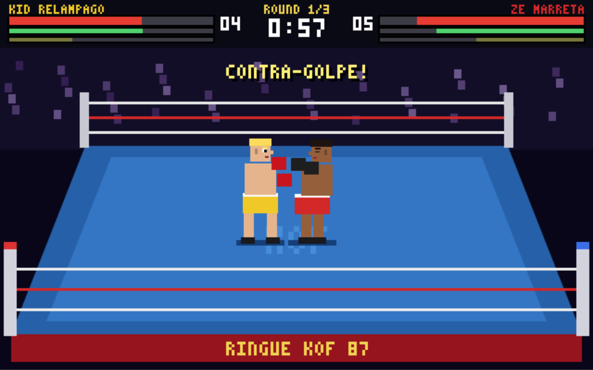
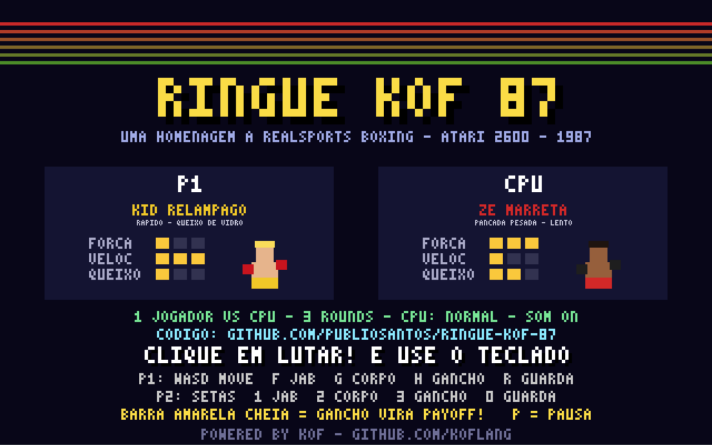

# Ringue KOF 87 🥊🕹️

https://github.com/PublioSantos/ringue-kof-87

Homenagem em **Kof** ao jogo de luta mais complexo do Atari 2600:
**RealSports Boxing** (Atari Corp., 1987, programado por Alex DeMeo).

Todo o jogo é Kof: lógica, ringue, placar e até a fonte
em pixels (3x5), desenhada pelo próprio programa num `Canvas` do `kof.ui`.
Sprites, nomes e arte são originais, inspirados no espírito do cartucho.





## Como rodar

**Jogue online:** https://publiosantos.github.io/ringue-kof-87/

Ou baixe **`ringue-kof-87.html`** (botão *Download raw file* na página do
arquivo) e abra no navegador: é o jogo inteiro num arquivo só, funciona
offline, sem servidor.

Com o Kof instalado:

```bash
kof run ringue.kf --target js         # roda no webview do próprio Kof
kof run ferramentas/empacotar.kf      # recompila e gera web/ + ringue-kof-87.html
```

O empacotador também é escrito em Kof (`ferramentas/empacotar.kf`): ele chama
o `kof build`, ajusta a página e junta o runtime e o jogo num único
`<script type="module">`, usando só `kof.io` e `kof.process`.

Compilado com o Kof4j `main` (commit `317d9f6`).

## Quantas linhas de Kof

| Arquivo | Linhas | Código (sem brancas e comentários) |
|---|---:|---:|
| `ringue.kf` (o jogo) | 1.474 | 1.282 |
| `ferramentas/empacotar.kf` (empacotador) | 97 | 78 |
| **Total** | **1.571** | **1.360** |

Tudo o que o jogo faz está nessas linhas: regras, IA, desenho, fonte em
pixels, síntese de som e codificação dos WAVs em base64.

## Como jogar

Clique em **LUTAR!** (ou em qualquer botão): isso ativa o teclado.

| | P1 | P2 (modo 2 jogadores) |
|---|---|---|
| Mover (esq/dir e profundidade) | W A S D (1P: também setas) | Setas |
| Jab | F (1P: também J) | 1 ou , |
| Soco no corpo | G (1P: também K) | 2 ou . |
| Gancho | H (1P: também L) | 3 ou / |
| Guarda (segurar) | R (1P: também I) | 0 ou M |

Enter = lutar / nova luta · P = pausa · N = som · botões na tela para mouse/touch.

## O que vem do RealSports Boxing

- **4 lutadores** com fichas diferentes (força, velocidade, queixo e ponto fraco na cabeça ou no corpo).
- **Energia e fôlego separados**: golpes gastam fôlego; cansado, você bate fraco, anda devagar e demora a se recuperar.
- **Ringue com profundidade**: você anda para frente e para trás, e o golpe só acerta quem está alinhado.
- **Barra de payoff**: acerte golpes para enchê-la; cheia, o gancho vira o **PAYOFF**, um soco devastador.
- **Quedas e contagem do juiz**: quem cai aperta os socos para levantar; 3 quedas = nocaute técnico.
- **Guarda, contra-golpe** (acertar quem está armando) e golpe no **ponto fraco**.
- **Rounds de 1 minuto** (3 ou 7), intervalo no corner e decisão por pontos.
- **CPU em 3 níveis** (fácil, normal, campeão) e modo **2 jogadores** no mesmo teclado.

## Som

Os 13 efeitos são sintetizados pelo próprio programa, em Kof, na abertura do
jogo: onda quadrada + ruído (LFSR) em 8 bits, como o chip TIA do 2600. Cada um
vira um WAV codificado em base64 pelo Kof e toca em 3 canais em rodízio.
Jab, corpo, gancho, payoff, bloqueio, soco no vento, gongo, contagem do juiz,
queda, torcida, levantada, sem fôlego e o blip do menu.
Liga/desliga: botão **Som** ou tecla **N**.

## Bugs do compilador encontrados

Durante o desenvolvimento apareceram dois bugs reais no compilador Kof
(conferidos contra o código atual do Kof4j, `main` em `317d9f6`); os repros
estão em `bugs-kof/` e as correções foram enviadas ao projeto:

1. **`bug-canvas-on.kf`**: `canvas.on("pointerdown", ...)` compila sem erro
   (o `kof check` passa), mas a chamada some do código gerado. O mesmo vale
   para qualquer método inexistente em widgets de `kof.ui`.
2. **`bug-jvm-event-key.kf`**: no alvo JVM (e no `kof serve`), passar `e.key()`
   de um handler `(e: Event)` para uma função que recebe `String` gera
   `java.lang.VerifyError` ao iniciar. No alvo JS funciona.

O jogo contorna os dois: não usa eventos no canvas e roda no alvo JS.

Um terceiro suspeito, `widget.setStyle(Style("..."))` sumindo do JS gerado,
era só um `kof.jar` desatualizado: no código atual do Kof ele funciona.

## Créditos

Criado por Públio Santos, com IA, como homenagem. RealSports Boxing é um jogo
da Atari Corp. (1987); este projeto não tem vínculo com a Atari e não usa
nenhum código, gráfico ou som do cartucho original.

Licença: MIT (uso livre), veja `LICENSE`.

---

Powered by Kof: https://github.com/KofLang
